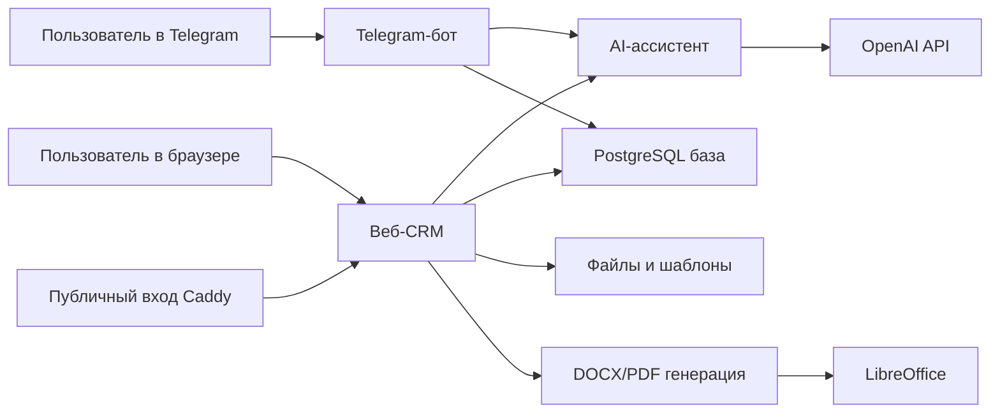

# Короткое описание CRM-проекта для клиента

Обновлено: 26 мая 2026

## Интро в двух словах

Это частная CRM-система для работы с архитектурными лидами, коммерческими предложениями и follow-up задачами.

Если совсем просто: это рабочий кабинет, куда попадают заявки от клиентов, где они превращаются в понятные карточки лидов, где можно подготовить КП, отметить отправку и не забыть следующий контакт.

Сейчас проект доступен здесь:

- http://204.168.163.99:3002/leads

## Что умеет система

- Хранит лиды, клиентов, проекты, документы и follow-up задачи.
- Принимает материалы по новому лиду из веб-интерфейса и из Telegram.
- Помогает разбирать “сырой” текст, PDF, фото и голосовые/аудио сообщения.
- Вытаскивает из заявки имя клиента, контакты, адрес, площадь BGF, тип запроса, недостающие данные и краткое резюме.
- Помогает готовить КП/коммерческие предложения из DOCX-шаблонов.
- Делает PDF-версию КП через LibreOffice.
- Позволяет отметить, что КП отправлено, и запланировать следующий контакт.
- Собирает обратную связь, технические заметки и историю действий ассистента.

## Из каких частей состоит проект

| Часть | Что это значит простыми словами |
| --- | --- |
| Веб-CRM | Основной кабинет в браузере: лиды, клиенты, проекты, документы, настройки |
| Telegram-бот | Быстрый канал для входящих заявок: можно переслать текст, фото, PDF, голосовое |
| AI-ассистент | Помощник, который читает входящие материалы и предлагает, что сделать дальше |
| База данных | Место, где хранятся лиды, документы, действия и настройки |
| Генератор документов | Берет DOCX-шаблон КП, подставляет данные и готовит DOCX/PDF |
| Файловое хранилище | Место для шаблонов и сгенерированных документов |
| Caddy | “Входная дверь” на сервере, которая направляет запросы в нужное приложение |
| Сервер | Виртуальная машина Hetzner, где все это запущено |

## Простая схема

## Где размещено

Текущий стенд:

- Провайдер: Hetzner.
- IP сервера: `204.168.163.99`.
- Папка проекта на сервере: `/opt/apps/crm-staging`.
- Публичная ссылка CRM: `http://204.168.163.99:3002/`.
- Внутренний порт веб-приложения: `3001`.
- Публичный вход идет через Caddy на `:80` и `:3002`, дальше Caddy передает трафик в CRM на `127.0.0.1:3001`.
- База данных PostgreSQL запущена в Docker и доступна только внутри сервера на `127.0.0.1:15432`.
- Системные сервисы:
  - `crm-staging-web.service`
  - `crm-staging-telegram.service`
  - `caddy.service`
- Текущая версия на стенде на момент подготовки документа: `35e1cc4 fix: stabilize lead summary accordions`.

Сервер уже организован так, чтобы на нем могли жить несколько проектов одновременно. У каждого проекта своя папка, свои порты, своя база и свои systemd-сервисы.

## За что потенциально платим

### То, что важно уже сейчас

| Сервис | Зачем нужен | Тип расходов |
| --- | --- | --- |
| Hetzner VM | Сервер, на котором работает CRM, база, Telegram-бот и Caddy | Ежемесячная оплата сервера |
| OpenAI API | AI-ассистент, разбор заявок, текстов, аудио/голоса | Оплата по использованию |
| Telegram bot | Канал, куда можно отправлять заявки и материалы | Сам Telegram бесплатный |

### То, что уже поддержано или может понадобиться позже

| Сервис | Зачем может понадобиться | Тип расходов |
| --- | --- | --- |
| Cloudflare R2 / S3-хранилище | Более надежное хранение шаблонов и сгенерированных файлов | Обычно по объему/трафику |
| Домен | Нормальная ссылка вместо IP-адреса | Ежегодная оплата домена |
| Email/SMTP/Resend | Отправка писем или ссылок на КП из CRM | Обычно по использованию |
| Stripe | Будущая оплата/подписки, если продукт станет SaaS | Комиссия/usage-based |
| Google/Slack | Будущие интеграции и логин | Зависит от настройки |

### Бесплатные/open-source части

- Next.js / React для веб-приложения.
- PostgreSQL для базы данных.
- Prisma для работы с базой.
- Caddy для маршрутизации.
- Docker для базы.
- LibreOffice для конвертации DOCX в PDF.
- Node.js, TypeScript и pnpm для разработки и сборки.

## Что хранится и где

- Данные CRM лежат в PostgreSQL на сервере.
- Файлы лежат либо локально на сервере, либо могут быть перенесены в S3-совместимое хранилище вроде Cloudflare R2.
- Секреты не лежат в документации: ключ OpenAI, токен Telegram, пароль базы, ключи хранилища находятся в server environment.
- Telegram-бот ограничен списком разрешенных chat ID.
- В приложении есть заготовка ролей, workspace-контекста и admin-доступа.

## Основные разделы интерфейса

- Today: текущие follow-up и дела на сегодня.
- Leads: список лидов, карточка лида, исходные материалы, КП, follow-up.
- Clients: клиенты.
- Projects: проекты и проектные задачи.
- Documents: сгенерированные КП и вложения.
- Settings: брендинг, язык, прайс-таблица, шаблоны КП.
- Platform feedback: обратная связь и продуктовые заметки.
- Platform audit: история действий и подтверждений.
- Assistant: веб-ассистент внутри CRM.

## Как обычно обновляется версия

Обновление идет из GitHub `origin/main`:

1. На сервере подтягивается свежий `main`.
2. Обновляются зависимости.
3. Генерируется Prisma Client.
4. Применяются миграции базы данных.
5. Собирается веб-приложение.
6. Перезапускаются web service и Telegram service.
7. Проверяется `/leads` через внутренний порт и публичный Caddy route.
8. Проверяется журнал Telegram-worker.

## Самое простое объяснение для клиента

Это CRM для архитектурного бизнеса, которая помогает не терять входящие заявки и быстрее доводить их до КП. Пользователь может отправить в систему сырой текст, PDF, фото или голосовое сообщение, а CRM вместе с AI-ассистентом помогает превратить это в карточку лида, список недостающих данных, документ КП и следующий follow-up.

Сейчас проект работает на сервере Hetzner. Основные регулярные расходы: сервер и OpenAI API. Telegram бесплатный. Домен, файловое облако и email-рассылки могут добавить расходы, если их включать в продакшн-версии.

## Что стоит решить перед полноценной передачей

- Оставляем доступ по IP или подключаем домен?
- Файлы оставляем локально на VM или переносим в Cloudflare R2?
- Какая нужна схема резервного копирования базы и файлов?
- Кто будет иметь доступ к CRM?
- Какие тексты и шаблоны КП считаем финальными?
- Нужен ли лимит или бюджет на OpenAI API?
