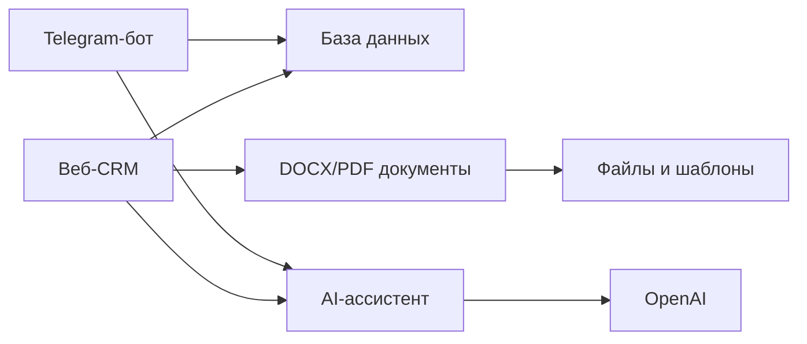

# Слайды для клиента: CRM-проект

## Слайд 1. Что это

**Частная CRM для архитектурных лидов, КП и follow-up.**

Она помогает собрать входящие заявки, превратить их в карточки лидов, подготовить коммерческое предложение и не забыть следующий контакт.

## Слайд 2. Главная идея

Один процесс, два входа:

- веб-CRM для работы в офисе;
- Telegram-бот для быстрых заявок и материалов;
- AI-ассистент, который помогает и там, и там.

## Слайд 3. Что делает пользователь

- Смотрит и ведет лиды.
- Отправляет сырой материал из Telegram.
- Загружает PDF, фото, текст и голосовые/аудио сообщения.
- Генерирует КП.
- Отмечает, что КП отправлено.
- Видит follow-up и следующие шаги.

## Слайд 4. Что делает AI-ассистент

Ассистент помогает разобрать хаотичный входящий материал:

- имя клиента;
- контакты;
- адрес;
- тип проекта;
- BGF/площадь;
- недостающие поля;
- краткое резюме;
- следующий шаг.

Важные действия он не делает молча: сначала предлагает, потом пользователь подтверждает.

## Слайд 5. Из каких блоков состоит система

## Слайд 6. Где это размещено

Сейчас проект работает на Hetzner VM:

- публичная ссылка: http://204.168.163.99:3002/leads;
- папка на сервере: `/opt/apps/crm-staging`;
- веб-сервис: `crm-staging-web.service`;
- Telegram-сервис: `crm-staging-telegram.service`;
- маршрутизация: Caddy;
- база данных: PostgreSQL в Docker.

## Слайд 7. За что платим

Главное:

- Hetzner VM: сервер.
- OpenAI API: AI-ассистент и разбор заявок.
- Telegram bot: канал общения, сам Telegram бесплатный.

Может понадобиться позже:

- Cloudflare R2 или другое файловое хранилище;
- домен;
- email-провайдер;
- Stripe;
- Google/Slack интеграции.

## Слайд 8. Почему это полезно

Система убирает хаос из входящих заявок.

Вместо того чтобы держать тексты, PDF, фото и голосовые сообщения отдельно, CRM превращает их в понятный рабочий процесс: лид, недостающие данные, КП, follow-up.

## Слайд 9. Что решить дальше

- Нужен домен или пока достаточно IP?
- Где храним файлы: на сервере или в Cloudflare R2?
- Как делаем резервные копии?
- Кто получает доступ?
- Какие шаблоны КП финальные?
- Какой бюджет на OpenAI API?
