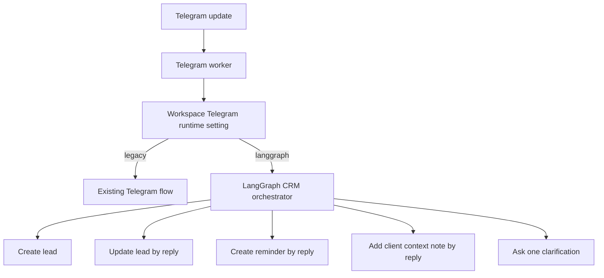

# LangGraph Telegram CRM Orchestrator Plan

Date: 2026-06-05

## Goal

Build a first testable LangGraph runtime for the Telegram CRM bot. A workspace admin must be able to switch Telegram from the legacy runtime to LangGraph in Settings, then test lead creation, lead updates, reminders, and client context notes through Telegram on the test environment.

## Architecture

## Slices

1. Add workspace runtime setting: `legacy` or `langgraph`.
2. Add Settings UI for Telegram runtime.
3. Add a real LangGraph orchestrator package with normalized action output.
4. Wire Telegram worker to load the setting and route messages through LangGraph when enabled.
5. Reuse existing low-level Telegram CRM tools for database writes, audit/history, reminders, and buttons.
6. Add tests for settings storage, graph routing, and Telegram worker handoff.
7. Verify package typechecks and focused test suites before any PR or merge.

## Test Runbook

Use `docs/langgraph-telegram-test-runbook.md` for the manual test-stand gate before enabling LangGraph outside the test workspace.

## Non-Goals

- No production deployment from this chat.
- No removal of the legacy runtime.
- No CrewAI implementation in this branch.
